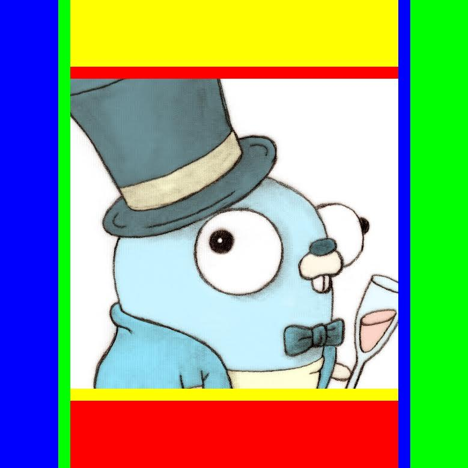

#Learn Go The Hard Way

Origined from the Go Gala hackthon.

##Inspiration:

Before Gala,I was having a talk with my friend,he thought coding is cool,and asked me to teach him to code.
At that time the idea came to my mind - How about write a open repository for gophers to learn how to code Go code by practice?

I got the name "learn-Go-the-hard-way" with the inspiration of "learn python the hard way",and decided to use the form of "Go tour" -
fill the unfinished functions in the source code.

##Target User

The target users are the gophers who had went through the online documents and tutorials like [Effective Go](https://golang.org/doc/effective_go.html),[A Tour of Go](https://tour.golang.org/welcome/1),and [build-Go-web-applications](https://github.com/astaxie/build-web-application-with-golang),assuming the users have basic understanding about Go and want to get something to do with the features of Go.

##Features

The key features are the form of learning Go.
All the tasks are challenging,and most come from the real open libraries as well as relevant papers or talks,however not difficult to complete.It will help you understand main parts of these works instead of browsing the huge code.

In my opinion the best way to learn coding is just coding.

There are currently 10 exercises,thoese works were done during the weekend of hackthon,so they are not seemingly that perfect,but I am sure,you will gain a lot if you finish the tasks.

##How to install

This repo has no dependencies,so you can install be typing:

`git clone https://github.com/gophergala/learn-Go-the-hard-way`

or

`go get -u github.com/gophergala/learn-Go-the-hard-way`

##How to use

You should complete the current exercise before you enter the next.

Each exercise is a git tag(from l1 to l10),you can check out the tag,and finish the task with tips.

Run `go test`,if you completes the task,and it will tell you wether you pass the task.

To get the tips,please run `go run main.go`,and follow the tips to modify `main.go`.

Now run `git checkout l1`,let's go!

##Exercies(currently available):

1.  warm up,reverse slice.
2.  parallel vector sum.
3.  cheat rock-paper-sissors.
4.  make map function.
5.  parallel dynamic programming.
6.  tiny webframework 1,managing context.
7.  tiny webframework 2,middleware.
8.  lexer.
9.  cheat sheet.
10. a surprise!

##Members:

[ggaaooppeenngg](https://github.com/ggaaooppeenngg)

PS:looking for an internship~求实习工作~

